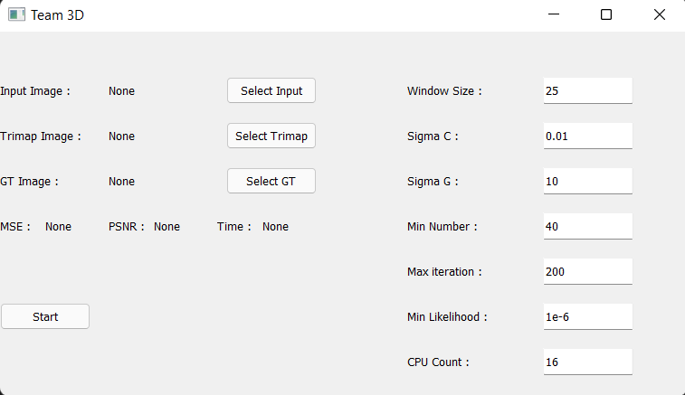
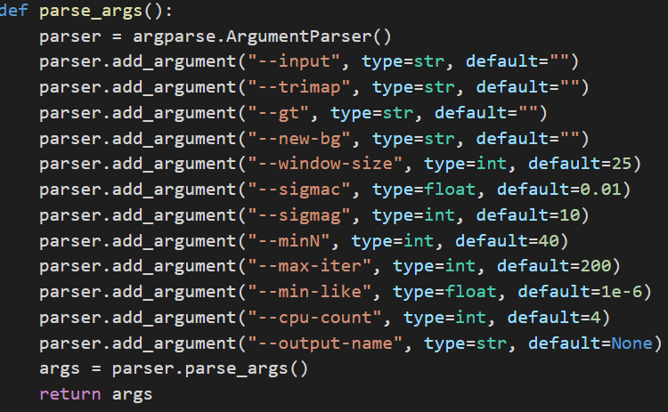

# Bayesian Matting
Bayesian matting proposes a method for solving matting problem such as extracting background and foreground with individual pixel values. In this project Bayesian Framework is implemented in Python environment.
# Installing Libraries
All required libraries can be found in requirements.txt
## Using Pip(Recommended)
```
pip install -r requirements.txt
```
## Using Conda
Multiprocessing has some bugs in Conda Environment. Therefore, if system raises any errors on Conda, application can be ran without using multiprocessing.
```
conda install --file requirements.txt
```

# Running
There are two options for running application. 
## Running GUI
```
python run_gui.py
```
<br/>



As can be seen above, GUI has textboxes for Bayesian parameters. These parameters can be changed by them. If application is desired to run without multiprocessing, cpu count should be set as 1.
## Running Terminal
```
python run_terminal --input <INPUT_IMG_DIR> --trimap <TRIMAP_IMG_DIR> --gt <GT_IMG_DIR> --new_bg <BG_IMG_DIR> 
                    --window-size 40 --sigmac 0.01 --sigmag 10 --minN 40 --max-iter 200 --min-like 1e-6 
                    --cpu-count 8 --output-name OUTPUT_FILE.PNG
```
Terminal application can be run as above. Reqired arguments are input, trimap, groundtruth and new background images. Other arguments have their own default value.
If application is desired to run without multiprocessing, cpu count argument should be set as 1. Parser method can be seen below for default parameters.

<br/>


### Example Running for Terminal
```
python run_terminal.py --input scripts/Samples/input1.png --trimap scripts/Samples/trimap1.png 
                       --gt scripts/Samples/gt1.png --new_bg scripts/Samples/input2.png
```
